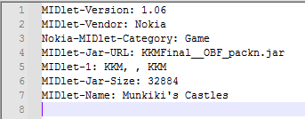

# JAD
*is boring*

# Trivia

## JAD is boring!

* JAD is plaintext
* JAD always contains the word `MIDlet`

JAD is boring!

## JAD example
*taken from [Wikipedia](https://en.wikipedia.org/wiki/JAD_(file_format)#Example)*

```
Manifest-Version: 1.0
Created-By: Apache Ant 1.5.1
MIDlet-1: Book Reader by TC, , br.BookReader
MIDlet-Name: BookReader
MIDlet-Vendor: tequilaCat
MIDlet-Version: 1.3.6
MicroEdition-Configuration: CLDC-1.0
MicroEdition-Profile: MIDP-1.0
MIDlet-Jar-Size: 24575
MIDlet-Jar-URL: bookreader.jar
TC-BookReader-Logging: true
```

# Extraction steps

## Tools used

* Input BLOB file  
* Trusty HEX editor with the ability to copy selections to new files. Such as WinHex.  
* [Notepad++](https://notepad-plus-plus.org) – to visually verify the .JAD file.  

### Additional resources

* [JAD specifications (JSR118)](http://download.oracle.com/otn-pub/jcp/midp-2.1-mrel-oth-JSpec/midp-2_1-mrel-spec.pdf)  

# Step 1 – Find JAD file

Finding JAD is easy.

JAD is entirely plaintext, encoded in simple ASCII (as opposed to Unicode). The structure is also basic and is not even JSON.

JAD follows the following basic structure:
```
Parameter: Value
```  
followed by a newline.

JAD practically always contains parameter keyword `MIDlet`. Furthermore, it practically always parameters:
* **`MIDlet-Name`**
* **`MIDlet-Version`**
* **`MIDlet-Vendor`**
* **`MIDlet-Jar-URL`** *(URL often refers to the JAR filename)*
* **`MIDlet-Jar-Size`**
* **`MicroEdition-Profile`**
 
Finding a .JAD is just a matter of finding any of these keywords and / or parameters.

 # Step 2 – Locate JAD's end
 
* JAD file contains many `0x0D 0x0A`, however, it always ends with `0D 0A`. 
 
* These bytes correspond to... `\r\n` or `CRLF`, [(source)](https://stackoverflow.com/a/71531204/12258312).  
  This combination of bytes is used in Windows, DOS, Symbian, and others as a newline character, [(source)](https://stackoverflow.com/a/1552782/12258312).  
 
 * Hence, you only need to find the last `CRLF` (HEX `0D 0A`), after which, there is no plaintext syntax of,  
	```
	Parameter: Value
	```  
 
This "locate" operation takes about 30 seconds.
 
 # Step 3 – Locate JAD's beginning
 
 Very similar process to "Step 2 – Locate JAD's end"
 
 you only need to find:
 * the first entry before the JAD's end
 * that follows the plaintext syntax of,  
	```
	Parameter: Value
	```  
	
Highly likely, this first entry with begin with the keyword `MIDlet`

This second "locate" operation takes about 20 seconds.

# Step 4 – Slice out into a file

 |
---- | 
Example JAD file slice. Notice `0D 0A` at the slice's end, and keyword `MIDlet` at the beginning.

# Step 5 – Verify results

 | 
---- | 
.JAD file in Notepad++

Ensure that,

* JAD file (as it typically does) starts with `MIDlet` keyword.
* There are no obvious errors visible to the naked eye.
* Trailing newline is present.

---------------------------------

***[Tim Abdiukov](https://github.com/TAbdiukov)***
