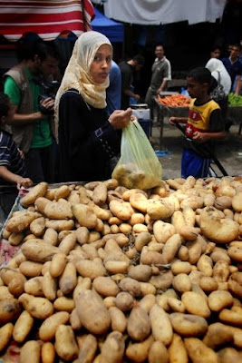

Crash course. Translated from an anonymous `telegra.ph` post.

I took the liberty to enhance information with more details. Most such details are marked with: **☆**.

# Myth 1/4: Israel occupied Gaza.

Gaza's history goes back 4,000 years. Gaza had been ruled, ruined and inhabited by various dynasties, empires and nations. Originating as a Canaanite (Hebrew) settlement, it was under Egyptian ruke for approximately 350 years, before being conquered by the Philistines and becoming one of their main cities. Many Arabs claim to be descendants of the Philistines, but the Philistines were not Semites, so this is false. It was in Gaza, according to the Book of Judges, that the Jewish strongman Samson brought down the Philistine palace and died under the rubble (**☆** [Sefaria ](https://www.sefaria.org/Judges.16.21-31) / [YouVersion](https://www.bible.com/bible/2692/JDG.16.21-31)).

Gaza was ruled by the Assyrians, Persians, Nabataeans. Alexander the Great also reached it. After a bloody assault, in which most of the inhabitants were killed, he took the city and turned Gaza into a center of Hellenistic philosophy and education. Gaza was gradually settled by Bedouins from the desert and Greeks, soldiers and traders. After the death of Macedon, two successor kingdoms of the great Alexander fought for Gaza - the Seleucids from Syria and the Ptolemies from Egypt. In 96 B.C. Gaza was besieged and captured by the Jewish Hasmonean dynasty.

When the Romans came to Judea, Pompey the Great (the same one who, together with Crassus, defeated Spartacus) recaptured it from the Jewish king Alexander Jannaeus. Under the Romans, Gaza flourished, under empire's protectorate. The city was governed by a senate of 500 members, including Greeks, Romans, Jews, Egyptians, Persians and Nabataeans.

Under Herod the Great, Gaza again became a vassal of Judea. By that time, most of the people living in it were Romans and Greeks. In the first century, during the Jewish uprising against the Romans, it was destroyed again. After the defeat of the uprising in 132 AD. BC, the Romans expelled a significant number of Jews from the country and renamed the province of Judea as “Syria Palaestina”, in order to forever erase the memory of the Jewish presence in these places. This is where the name Palestine comes from.

After the collapse of the Roman Empire, Gaza fell to Byzantium. Saint Porphyrius insisted on Gaza's conversion to Christianity at the end of the 4th - beginning of 5th century, destroying the sanctuary of Gazan god Marnas, well known throughout the Roman empire (**☆** and Hellenistic community ages prior, who [depicted Marnas equivalent to Zeus](https://de.wikipedia.org/wiki/Marnas_(Gaza)#/media/Datei:Statue_of_Zeus_dsc02611-.jpg)).

Two centuries later, Gaza was conquered by the Muslim general ʿAmr ibn al-ʿĀṣ, and most of the inhabitants were forced to convert to Islam. The Crusaders wrested control of Gaza from the Arab Fatimid dynasty in 1100, but were driven out by Saladin. By the end of the 13th century, Gaza was in the hands of the Mamluks, and became the capital of a province stretching from the Sinai Peninsula to the border with Syria. In the 16th century, Gaza came under the control of the Ottoman (Turkish) Empire for long 400 years. In 1832, the territory of Gaza was conquered for 8 years by Ibrahim Pasha of Egypt, eldest son of Muhammad Ali, the Wāli (governor) or Egypt. The Egyptians carried out some reforms along European lines, which caused Arab resistance and uprisings in most cities of the country, which were being suppressed by force. During this period, extensive research was carried out in the field of biblical geography and archaeology, and as a consequence thereof, we know that all this time small Jewish communities remained in and around Gaza. The Jewish presence in Gaza ended in 2005 when Israel voluntarily withdrew.

In 1917, during World War I, the Ottoman Empire collapsed and the League of Nations (predecessor of the UN) gave Britain a mandate to govern Gaza. Good days have come - with their characteristic pedantry, the British began to restore order. In 1948, after UN Resolution 181 partitioned Palestine between Jews and Arabs, the Arabs (**☆** immediately) went to war, and Gaza came under Egyptian rule.

In 1967, Gaza and the Sinai Peninsula were captured by Israel during the Six-Day War. When Israel and Egypt came to a peace agreement in 1978, the Sinai Peninsula was returned back to Egypt, but the Egyptians showed little interest in Gaza. Unfortunately for Israel. During the First Intifada (a wave of Arab terrorist attacks against Israel), Gaza became a center of political activity and a major headache. The 1993 Oslo Accords placed it under the direct control of the Palestinian Authority.

In 2005, Israel voluntarily and unilaterally withdrew from Gaza, leaving the Palestinians with prosperous farmland and farms, stunning beaches and a rich fishing zone. Everything required for a happy life, in order to become a new Singapore of the Middle East. But in 2007, HAMAS won the elections in Gaza and began to sow seeds of hatred on an unprecedented scale. Singapore did not work out, the farms were burned, and in their place rocket launchers appeared and shelling of the border areas of Israel began. In 2007, after three weeks of massive rocket attacks on civilians - after three weeks of shelling! – Israel began a blockade of Gaza (discover more about the blockade below). Every couple of years, in response to rocket attacks and murder of Israeli civilians, including children, Israel carried out military operations to destroy militants and artillery.

And then October 7, 2023 came. 1400 killed, raped, stabbed, burned, tortured Israelis. 230 hostages, the youngest of whom is 10 months old. 18 years after Israel VOLUNTARILY left Gaza. This is the occupation and the response to it.

# Myth 2/4: Gaza is broke

* Testimony of the French journalist (Le Figaro) [**Adrien Jaulmes** dated **June 2, 2010**](https://www.lefigaro.fr/international/2010/06/02/01003-20100602ARTFIG00702-la-population-de-gaza-paie-l-addition-pour-tout-le-monde.php), first section, last paragraph: 

	> The blockade of Gaza is one of the strangest systems there is. In the markets of Gaza City, the stores are overflowing with all kinds of goods. The shelves are filled with fruits and vegetables. Appliance stores sell huge refrigerators, telephone stores sell the latest models of cell phones. Computers, Play Stations, toys, frilly wedding dresses, spices and medicines: nothing corresponds to the idea of any crisis, let alone a humanitarian crisis.

	(**☆** Google-translation. The original article had incorrect reference, corrected)

* Testimony of the Danish journalist Steffen Jensen, as evidenced by [his professional activity](http://www.steffen-jensen.dk), cannot the least be suspected of sympathizing with Israel, [asks "Where's the humanitarian crisis?"](https://elderofziyon.blogspot.com/2010/06/danish-report-from-gaza-wheres.html). The page translates the original article, posted by Steffen Jensen in Danish,

	> I must admit I was a little surprised. Because when I call down here to my Palestinian friends, they tell me about all the problems and deficiencies, so I expected that the crisis was a little more clear.
	
	

	> And the first woman we interviewed in the market confirms this strange, contradictory, negative mindset:
	
	> "We have nothing," she said. We need everything! Food, drinks ... everything! "
	
	> It disturbed her not at least that she stood between the mountains of vegetables, fruit, eggs, poultry and fish, while she spun this doomsday scenario.

* Testimony of Mathilde Redmatn, deputy head of the Red Cross in Gaza (April 2011), 
	> There is no humanitarian crisis in Gaza. If you go to the supermarket, there are products. There are restaurants and a nice beach.

So there is food and consumer goods in Gaza, but most people don’t have the money for them. How is it possible?

In 2009, Gaza received $948 million in American aid. In 2010, the US and the EU gave it $413 million, and in 2011 - $514 million. Additionally, gave: Sweden (47 million), UK (45), Norway (40) and the Netherlands (29).

Through all this time, Gaza received over $1.18 billion in donations in 2021 and over $1.17 billion in 2022 from various countries and organizations.

## Where did the funds go?

Where is infrastructure, the hospitals and schools built, the cultivated fields, the factories, where are the houses and roads? Where are the jobs created? There is none. Because instead, billions were spent on TENS OF THOUSANDS of missiles, mines, diversion tunnels, because instead of hospitals they built bunkers for the HAMAS military command, and artillery was placed within existing hospitals, schools, and residential buildings. And after Israel destroyed these tunnels and bunkers, they built them again.

What was not spent on wars went into the pockets of HAMAS leaders. Journalist Palki Sharma Upadhyay (India) [writes](https://twitter.com/palkisu/status/1713817751696158940):
> “There will be no migration from Gaza to Egypt” says HAMAS leader Ismail Haniyeh, who himself is in Doha “currently leading a lavish lifestyle.” Haniyeh reportedly watched the HAMAS attacks on Israel from the comfort of his office in Qatar. He’s a millionaire with 13 children, including sons who are real estate tycoons and have Turkish passports. His family left Gaza a few years ago.

So the poverty and unemployment of Gaza are a consequence not of the Israeli blockade, but of the corruption and militarism of HAMAS leadership.

# Myth 3/4: Israel seals Gaza off

International law does not require any country, including Israel, to have an open border with an independent territory where a hostile population lives.

[**☆**] The border between Gaza and Egypt remains closed most of the time, however, it's never a news topic. Arabs #1 cannot get along with Arabs #2 and maybe this means something.

No defensive measures taken in response to enemy attacks are qualified by international law to be a collective punishment.

All the while the so-called 'blockade' lasts, a flow of products, things, materials from Egypt, from Israel, from the sea flows into Gaza, partly smuggled, partly as part of humanitarian aid. Israel is constantly creating humanitarian corridors. What are the materials obtained through these corridors used for? You guessed it, to create rockets and tunnels, to hold children's camps in which five-year-olds march with machine guns and shout "Death to Israel!", and teenagers train to kill. Yet Israel periodically allows these materials into Gaza, allows Palestinians into Israeli hospitals, allows family reunifications - finding out time and time again that none of its kind gestures are reciprocated; yet choose to do them again and again in order to act kindly, mercifully, and humanely.

# Myth 4/4: HAMAS is fighting for the liberation of Palestine.

Why do we need to liberate Palestine? To improve the lives of the Palestinian people, right? But HAMAS spends the lion's share of international aid not at all on raising living standards - on military needs. Why?

Because HAMAS has one goal - to stay in power for as long as possible. And during a war it is easier to suppress resistance, steal, put public funds in your own pocket - the war will write off everything. War - any war - justifies the fight against dissent, a decline in living standards, and rigid ideological boundaries.

War makes a fighting person significant, people who only know how to kill - what will they do if peace suddenly comes? They don't know how to build. The old tried and tested method remains - appoint an enemy, blame them for all your failures - and fight, fight. The more dead and wounded in the next mess, the higher the degree of hatred towards the "enemies" fueled by propaganda. So the need for even the most recent concern disappears - not about the well-being, for that matter, just about the safety of one’s own people.

# Conclusion: Lessons learned?

* The Gaza Strip NEVER belonged to the Arab country called Palestine and was never taken from it by Israel. For the simple reason that there has never been such a country throughout history.

* Israel COMPLETELY withdrew from the Gaza Strip in 2005.

* In 2007, Gazans voted for HAMAS in elections, which immediately began firing artillery at Israel from the Gaza Strip.

* The blockade came into effect in 2007, two years after Israel's withdrawal from Gaza, when the frequency and intensity of HAMAS rocket attacks made life in Israel's border areas absolutely unbearable. Israel periodically opened a humanitarian corridor, each time receiving increased shelling in response.

* Billions of dollars were donated to the Gaza Strip, but were used to purchase or manufacture weapons, to build terrorist tunnels, and for the personal enrichment of HAMAS leaders.

* From 2005, when Israel withdrew from Gaza, to 2023, more than 20,000 (!) artillery were launched from the Gaza Strip towards Israeli civilians.

Just as we didn’t start the previous one, and the one before it, and the one before it, and all the wars that we are forced to wage - this war was not started by Israel. But in response to the murder of children and women, in response to the taking of hostages, in response to rocket attacks of unprecedented intensity, attacks from which there is nowhere to run, because they are now shooting at us from both the south and the north, we must not remain silent, we must not endure and complain to the UN. As such, Israel has a right to respond as it sees fit.
