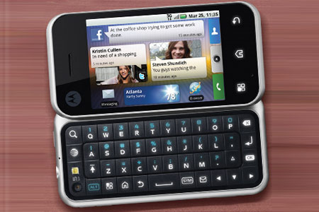

With many shattered guides, I unified this helpful information.

## Prerequisites
* Windows 7+ computer
* Motorola Backflip

## Initial steps
1. Find out if your device is already rooted (e.g., Superuser or SuperSU app is present) and what is the OS version. Perhaps this guide does not need to apply. Otherwise, you can discover the OS version by accessing,
	```
	Menu -> Settings -> About phone -> OS version
	```
2. Make a backup of all your sansitive data
3. Download and install official Motorola drivers, [32bit](https://web.archive.org/web/20130424082948/http://www.motorola.com/staticfiles/Support/Experiences/Global_Drivers/USB_Drivers_32_bit_4.6.5.zip) or [64bit](https://web.archive.org/web/20130424082515/http://www.motorola.com/staticfiles/Support/Experiences/Global_Drivers/USB_Drivers_64_bit_4.6.5.zip)

## Root
### On stock Android 1.5

1 Download [All you need to flash Motorola phones](https://addictivetips.com/app/uploads/2011/01/Moto_MSM_Root.zip)  
2. Follow instructions in this [archive link](https://web.archive.org/web/20130429180550/http://modmymobile.com/forums/406-motorola-backflip-motus/555749-root-all-versions-backflip.html)

### On stock Android 2.1 Enclair
Follow instructions on [this archive link](https://web.archive.org/web/20130604001109/http://modmymobile.com/forums/567-motorola-backflip-general/558403-how-flash-j_r0dd-mb300-v1-7-6-1-final-recovery-official-2-1-eclair-update.html) instead.

## Recovery
1. Download [j_r0dd-mb300-v2.0.zip](http://www.mediafire.com/file/4limlcamj4tv7dl) (v2.7.11) / [mirror](https://archive.org/details/j_r0dd-mb300-v2.0)
2. Follow the instructions corresponding to your Android version,
	* Android 1.5: [archive link](https://web.archive.org/web/20140217075454/http://modmymobile.com/forums/566-motorola-backflip-roms/555774-recovery-j_r0dd-mb300-v2-0-2-7-11-a.html).
	* Android 2.1 [this archive link](https://web.archive.org/web/20130604001109/http://modmymobile.com/forums/567-motorola-backflip-general/558403-how-flash-j_r0dd-mb300-v1-7-6-1-final-recovery-official-2-1-eclair-update.html) instead. Use the same *j_r0dd-mb300-v2.0.zip*

## Custom firmware
1. Push firmware file onto SD card. For Motorola Backflip, CM7 (Cyanogenmod 7) and j_r0dd's Preclair (1.2+) are available.
2. While the phone is connected to PC in adb mode, run,
	```
	adb reboot recovery
	```
3. When in recovery mode, pick "install new firmware" -> "from SD card" -> pick desired file.
4. After installation complete, go to Storage -> Clean user data. Whern clean cache and Dalvik-cache.
