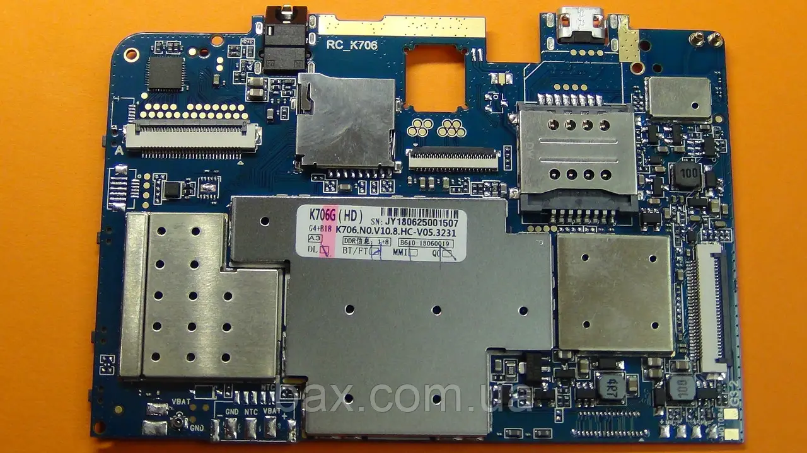

Laser MID-787 is a model title for a family of cheap and bad Chinese tablets. 

Luckily, Laser MID-787 can be unlocked thanks to efforts on another Chinese tablet that was sold in Ukraine circa 2018.

These Chinese tablets the following in common:
* Bad screen quality with horrible angles.
	* Screen size: 7", 8", or 10.1".
	* Screen resolution's longest axis is equal to `1024` or `1280`.
	* Often (not always) mathematically bad 16:9 / 16:10 ratio implementation, such as `1024x600` (`600*16/9=1066⅔`).
* **SIM-card slot**
* Internal PCB markings with **`K706`** (or ∂erivatives, e.g. **`K706x`**)
* MediaTek (MTK) CPU of MTK 8321 (MTK 6580)

## K706

Unfortunately, I lost my PCB photos. However, the PCB looks like this,

 | 
---- | ----
"K706B" on yellow label upside down [source (ar)](https://gsmserverpro.com/index.php?a=downloads&b=file&id=12764) | k706 **(almost certainly the same PCB without battery!)** [source: prom.ua](https://prom.ua/ua/p1518684301-bravis-nb753-plata.html).

### Other known K706 (K706x) family tablets,

* BRAVIS NB85
* **Bravis NB753**
* Digma CITI 7591 3G
* Ergo Tab A710 3G
* Krono 7031
* **Laser MID-787**
* NAVITEL T707 3G
* NAVITEL T500 3G Auto
* CTRONIQ Snook X75

## Prerequisites
* Windows computer
* Laser MID-787 (or compatible clone)
* USB cable

### Downloads

* MTK Android Driver All-in-One
* SP Flash Tool v5.1540, v5.1916, or newer – either standalone (use GSM forums) or [within official MID-787 Firmware Update](https://www.laserco.com.au/download/data/support/MID-787/MID-787%20Firmware%20Update.zip)
* Older **`7.0_MT8321_K706.N0.V10.8.CQ-V07.2493`** firmware (~1GB compressed/~2GB uncompressed) – [Firmware247](https://firmware247.com/laser-mid-787-firmware/) (leads to GDrive, password: `https://firmware247.com` ) / [archive.org](https://archive.org/details/laser-mid-787-7.0_mt8321_k706.n0.v10.8.cq-v07.2493.zip) (no password) – comes with SCATTER
	> Model: LASER MID-787
	> Os : Android 7.0
	> Language support: Multilang
* [Bravis NB753 custom TWRP recovery](https://archive.org/details/recovery-4pda) (transplanted from yet another tablet) – by `coditnets`. 
	> Transplanted recovery.img only works in landscape mode. Otherwise, works OK.
* [K706.N0.V10.8.CQ-V07.2493-GMS – Patched LittleKernel (LK.bin)](https://archive.org/details/k706.n0.v10.8.cq-v07.2493-gms-patched-littlekernel-lk.bin) – Produced by me
* Download [latest Magisk .APK](https://github.com/topjohnwu/Magisk/releases)

## Explanation

* SP Flash Tool, by default, performs a cyclic redundancy check, so **CRC check information has to adjusted or disabled**.
* Transplanted recovery.img for Bravis NB753 only works on Laser MID-787 in landscape mode. Otherwise, works OK. Picture from another life,
	

* Trivia: [BRAVIS NB753 specs on Rozetka ua](https://rozetka.com.ua/ua/bravis-nb753-7-3g/g7190433/), and it is too old to be sold.
* For Laser MID-787: LittleKernel (LK.bin) has to be patched. Otherwise, LK.bin prevents tablet from booting with 
	* LK.bin doesn't seem to be transplantable or otherwise interchangeable from other `k706` tablets, because LK.bin also contains compiled individual drivers. So, stock LK.bin from `7.0_MT8321_K706.N0.V10.8.CQ-V07.2493` had to be patched.

### Why older Laser MID-787 firmware?

The reason why older Laser MID-787 firmware is recommended deserves its dedicated section. I believe that changes across firmware builds may demonstrate that **Laser is involved in anti-consumer practices**,

Comparison can be seen below, better aspects are <ins>**highlighted**</ins>,

≡ | Laser's official "MID-787 Firmware Update" | `7.0_MT8321_K706.N0.V10.8.CQ-V07.2493`
---- | ---- | ---- |
Android OS Version | <ins>**Android 10**</ins> (Go) | Android 7 |
Google SafetyNet Attestation | <ins>**Pass**</ins> | <ins>**Pass**</ins> |
Display driver | Horrible, even with customisations. Graphical glitches, such as flickering dots across screen, do occur. | <ins>**Noticeably better, even on bad display**</ins>. Likely shows that "official" firmware uses incorrect driver.
[GApps](https://wiki.lineageos.org/gapps/) | Present, Google Go-based (tight coupling with Google Play Services, much slower on slow CPU!) | Present, <ins>**minimal and AOSP-based**</ins> (little/no coupling with Google Play Services) |
Speed | Horrible. The firmware comes with built-in RAM optimizer that barely helps (likely due to reasons above) | <ins>**Fair**</ins>
fastboot (bootloader) interface | Functionality is broken (always "USB Device Not Recognized", jeopardising repairability!) | <ins>**Works as expected**</ins>
`fastboot oem unlock` | Broken, because fastboot is broken! | <ins>**Works as expected**</ins>
Overall customisability and experience | Painful | <ins>**Not great, but more acceptable**</ins>

# Guide

## Getting started

1. Download everything
2. Charge up tablet to at least 50%.
3. In `K706.N0.V10.8.CQ-V07.2493-GMS` folder, open **`Checksum.ini`**. In **`IsEnableChecksum`** section, change **`CHECKSUM_SWITCH`** to **`0`**.
	* Alternatively, you may opt to keep file as is, and keep adjusting checksums in this file, as SP Flash Tool informs you of checksum errors. This option is safer, but more tedious.
4. Open SP Flash Tool.

## In SP Flash Tool

1. Ensure **`Download`** tab is selected.
2. For `Scatter-loading file`, select **`MT6580_Android_scatter.txt`** from `7.0_MT8321_K706.N0.V10.8.CQ-V07.2493`. The flasher program will load for ~10-20 seconds.
3. Once loaded, in drop down menu below, pick **`Format All + Download`** (being cleanest option) or **`Download Only`** (often recommended option)
4. In spreadsheet below,
	* For name **`lk`**, select custom **`lk.bin`**
	* For name **`recovery`**, select custom **`recovery.img`**
5. Click and thus toggle green "Download" button.

## Flashing process

1. Ensure tablet is fully turned off.
	* If you disassembled the tablet, then next to power button, there is a normally inaccessible, tiny `RESET` button/switch. This button/switch can be pressed with a tiny flathead screwdriver, and it shuts off power from the CPU, halting its operations.
2. Once green "Download" button is clicked on SP Flash Tool, connect tablet to the computer without pressing any buttons on the tablet. The computer should recognise the tablet and begin flashing.
	* Sometimes, computer does not recognise in time or hangs, and the tablet boots normally. If this happens, simply turn off tablet again and try again. I had to try at least 3 times before I was successful.
3. Wait until the flashing process is complete. SP Flash Tool will inform you by,  
	
	
4. Disconnect tablet from the computer.
5. Either connect the tablet back, or turn the tablet to the computer, causing its hardware to initiate.

## First boot

You will boot into Android 7. 

Go through first-run stage.

## Copy files

1. Copy `Magisk-*.apk` to the tablet.
2. Make another of the said `Magisk-*.apk`, name it `Magisk-*.apk.zip`. It will be used for rooting process

## Root

### Reboot into recovery

1. Enable "Developer Mode"
2. Enable "adb" interface
3. Connect to computer
4. Authorise "adb" connection signature from the computer, 
5. Run 
```
adb reboot recovery
```

* Note: **`fastboot oem unlock`** should not be required with custom `lk.bin`.

### In TWRP recovery

* Note: Transplanted TWRP only works on Laser MID-787 in landscape mode. Otherwise, works OK.

1. Flash `Magisk-*.apk.zip`
2. (Optionally) flash any other desired tweaks
3. Reboot to Android

### In Android

`Magisk-*.apk.zip` will install temporary `su`, but it won't install Magisk app (APK) itself. Therefore, use AOSP file manager to install Magisk APK.

Connect to the internet.

After Magisk app is installed, run it. It will complain of the "incomplete installation" and suggest options to fix this. Simply go through its default options. Magisk will require at least 2 reboots, and this is normal. After a few reboots, you will have fully rooted tablet.

### Optional – Delete GApps and further customise

Unlike on official Android 10, display does not need to be adjusted to be useable.

There is nothing extraordinary about this step. I don't recommend any "GApps remover" scripts, as they (as of 2023) do not verify what they are deleting. As such, I recommend using any common Root-based app manager, such as Titanium Backup and your brain, to delete unwanted GApps.

At this point, you fully unlocked, rooted and customised your Laser MID-787. Congratulations!

---------------------------------

***[Tim Abdiukov](https://github.com/TAbdiukov)***
