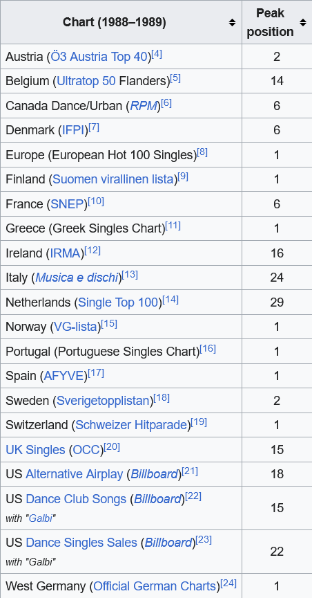

My productivity music of choice is either: Eurodance, phonk, or psytrance.

I recently came across this song on my favorite channel, [Kordhell - Shoot To Kill [Extended] – Phonk Extended](https://www.youtube.com/watch?v=d774nUbG0jY). 

Within the first 5 seconds, I immediately recognized the motif! This is Ofra! Ofra Haza!

Productivity meets culture. Many people never heard of her, which is a shame. Regardless, here is the song the motif it's from,

**[Im Nin'Alu - Ofra Haza](https://www.youtube.com/watch?v=ZRnzTTYk7_Q)**

*In my opinion, this song is magical and once it's heard, it cannot be 'unheard'*

As I was writing this post, I did more research and found out that Ofra Haza was more widespread in Europe than other parts of the world. She was said to be Madonna of the East,

  
*popular in Europe, not so much elsewhere*

I'm an analyst, and KORDHELL is probably from Europe if he/she used this motif in their song. Speaking of, I didn't really like "Shoot to Kill", but I loved "Live Another Day". However the case, I hope the reader can benefit from learning something new! 
