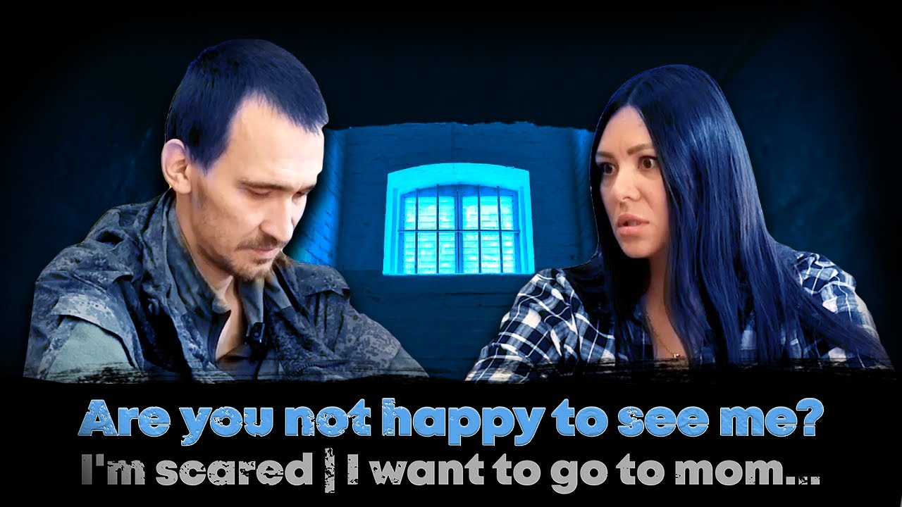

"Krynina" surname is a conviction to the entirely of ruZZian society. Krynina's case is telling about ruzzian mentale, but I will enlighten only about most important parts of inner workings of mentale, which really matter.

Krynina Iryna's case, just life Object-Oriented Programming and life in general, can be applied to talk about many facets of life, however, I will focus more where it matters the most - female impotence.

Krynina Irina (Ukr:/ Iryna) is a N.Korean-Russian lady from Krasnoyarsk, Russia. Krasnoyarsk is deep in Siberia, more than 4000-5000 kM away from Ukraine. Iryna however, had a very nicely set life. She received 120,000 ₽ /month as alimony from her former filthy-rich husband, This is about US$2000/mo, or US$4000/mo according to the perceived exchange rate (US$ as in USD). She de facto married another man, who was later mobilized into war. Iryna's unofficial husband was mobilized unbeknownst to her, but she loved her new husband so much, that she was willing to risk everything to rescue him.

And she did.

**[DVRST - My Toy](https://youtu.be/CqGOwGQtCFk)**

Her husband, extremely luckily, has not killed, but was just imprisoned. Human's life is infinitely precious. Irina is the first russian citizen to apply for "let a wife get back her husband" program! She gambled away her nice life, her 3-bedroom real estate, nice luxury SUV; everything -- to bring back her husband. Once she received indepenent legal councel informing her that this is impossible, she devised another clever but impossible plan.

The FSB (Federal Security Service, akin to the USA's FBI) discovered her intents and questioned her. She evaded certain ruin if not death by sheer luck and prying mind.

She did not give up and later, pretending to go on a leisure vacation to Türkiye with her children, she contacted Ukrainian intelligence agencies about her plan. Ukraine granted her permission to enter Ukrainian land, which is normally practically impossible for ruzzian nazi citizens. Once she, through interrogations and hardships, managed to get to Türkiye (Turkey), she completely forfeited any 'pleasure' activities. Completely giving up uon any corporeal assets and pleasures, she traveled from Türkiye to Chișinău, Moldova, the Moldovan authories were astonished to see a ruzzian citizen with a Ukrainian visa. All legal operations wit citizens of ruzzia are forbidden in Ukraine since 2022. Luckily, Moldovan authorities granted Iryna entry into the Europe.

Later, she and her children were picked up from Chișinău by (Apostile) Dmytro Karpenko. Dmytro traleveled them to a PoW camp where Iryna's husnand was held. And since then, all was set to end well. However,

(*Faberge' Egg. Human life is infinitely more precious than a physical corporeal egg*)

However, Iryna's husband said "what the fuck for" and was really upset. He cared more about seeing his mother than any moral values.

To say the least, a story that could have become Ukraine's break through the empaphy -- had bekommen Ukraine's set of many disheartening stories. I can't express my disappointment.

But not all was lost. Krynina had bekommen to be a Ukrainian government advisor of Ukrainian PoW. She now interrogates ruzzian prisoners of war as a part of her job.

Nonetheless, there is a public YouTube recording of polygraph assessment of Iryna Krynina herself. She was honest about many facets of her life, except one. She lied about votng for putin. She lied about not voting for him, whereas the polygraph shown that she did, by approximately 125% from the observed equilibrium (Hello, UNSW's MATH3411). Side note, like many things Ukraine, Ukraine may lack in more basic aspects of life, but techniqical Ukrainian polygraph techniques used, objectively and most importantly quantifyingly, are far ahead of (r)ussia and USA combined, whose techniques are similar but outdated. But, arguably I digress. 

I will probably create some (~14%) public GitHub repositories about it when I get time.

Iryna Krynina's husband had said that he wants to see his mother, and he indicated that his mother is more important to him than his wife.

What can one say? Iryna (Irina) chose to risk everything for her husband and failed, yet what is the morale of her story? Other wives chose to stick their tongues in their butts, thus demonstrating their inability, impotence. Maybe the whole-entire point of our lives is that life is meaningless. However, I certainly choose not to believe so, because it doesn't make sense.

You can discover more here,

* [Russian wife risks her life fleeing to Ukraine with children to see her prisoner of war boyfriend and reveal Putin's 'lies' - only for the stunned soldier to ask 'what the f*** for?' in bizarre reunion video](https://www.dailymail.co.uk/news/article-12576491/Russian-wife-risks-life-fleeing-Ukraine-children-prisoner-war-boyfriend-reveal-Putins-lies-stunned-soldier-ask-f-bizarre-reunion-video.html)
* [hRussin will Partner aus Gefangenschaft holen - und wird zum Star
(https://www.n-tv.de/politik/Russin-will-Partner-aus-Gefangenschaft-holen-und-wird-zum-Star-article24488755.html)
* [Russian woman reunites with prisoner of war boyfriend - but he's not pleased to see her](https://www.mirror.co.uk/news/world-news/russian-woman-reunites-prisoner-war-31070645)
* (AI/ML) [Ukraine launches chatbot service for relatives of missing Russian troops
](https://www.reuters.com/world/europe/ukraine-launches-chatbot-service-relatives-missing-russian-troops-2024-01-10/)

----------------------------------------------------------------------------------------------------------------------------------------------------------------------------------------------

**</ins>[RISKING LIFE TO GO TO UKRAINE TO SEE HER HUSBAND| Dissidents | @Zolkin Volodymyr
](https://www.youtube.com/watch?v=onR_2AKWsq4)</ins>** -- primary video.

