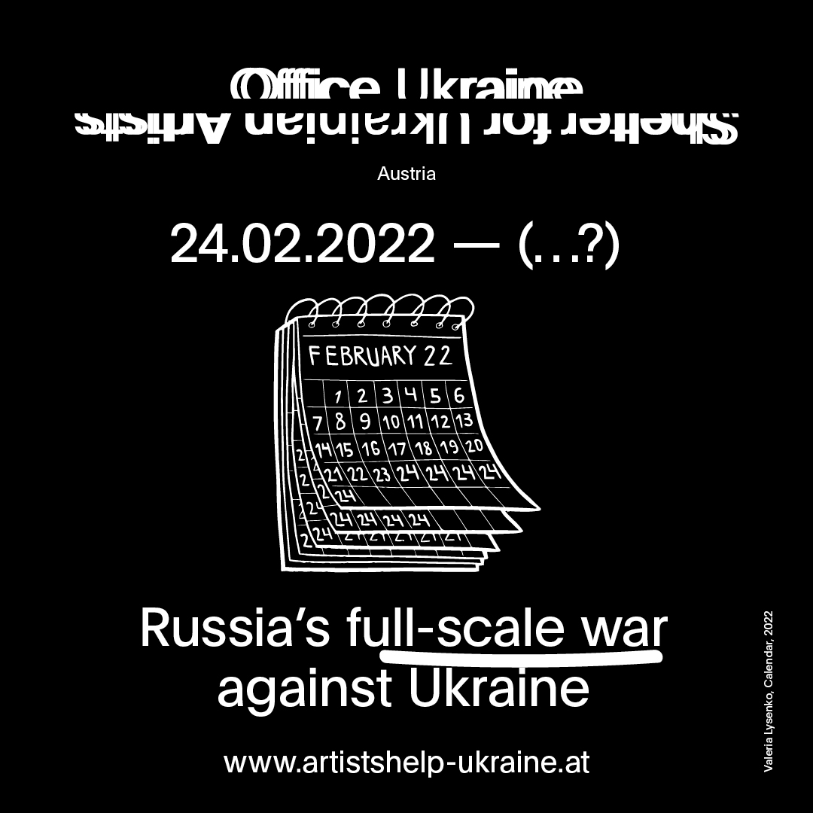
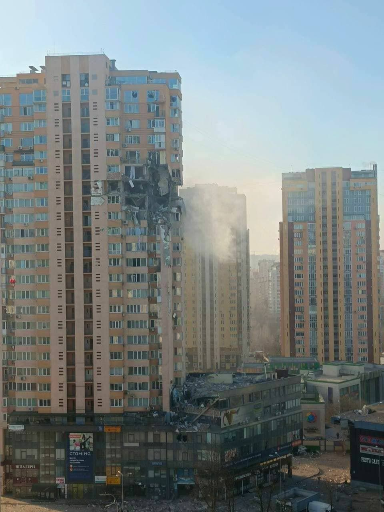
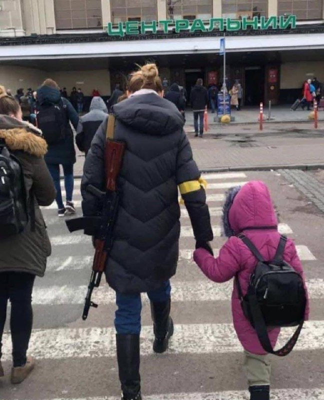
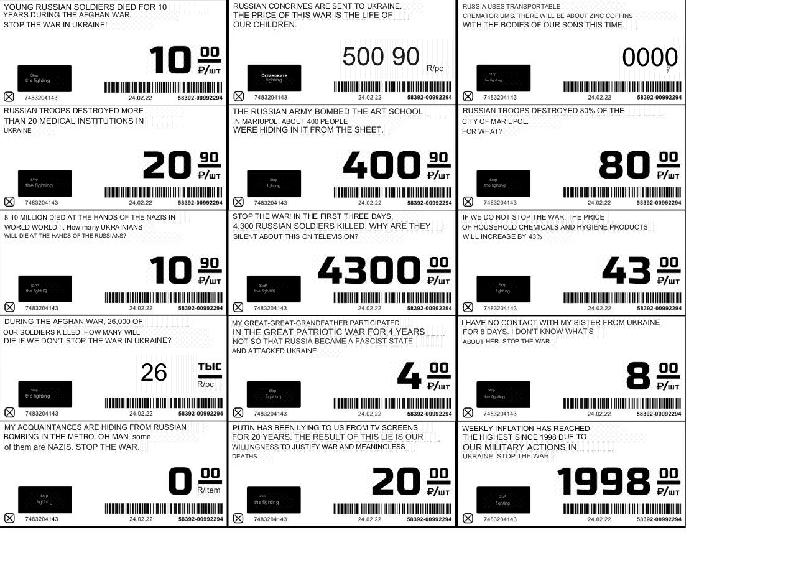
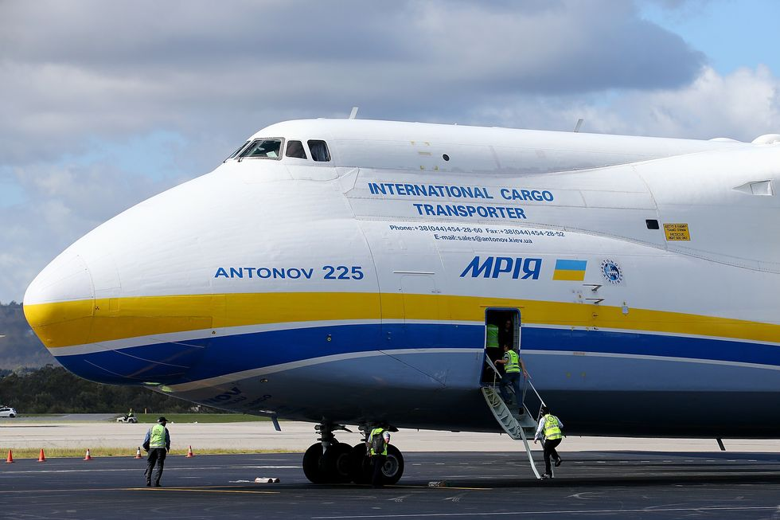

This is the second anniversary of the war of unknown duration.

There is an important detail in the image above. Every day had become a neverending 24.02.2022. 

I know a professor who taught at UNSW, who unfortunately lost his sanity over war.

On the day 1, all main Ukrainian TV channels united into `Єdyni Novyny` and during the first day and night, it kept the spirits up. Especially poorly censored news reports. From get-go, it was clear that there is no recovery after it.

For me, it all started with this,

and if I recall correctly, nobody died there. Many thousands of Ukrainians will die in months, so on this occasion, I guess it was a miracle. Alcohol sales were immediately prohibited in Ukraine and people risked lives going to a supermarket. I try to think how it was possible to just live, to eat and to drink - my best guess is that it was some sort of mental auto-pilot and incomplete coprehension due to shock.

russia launched an AI-generated video of Zelensky asking Ukraine's soldiers to surrender, and nobody believed it. Same day, Zelensky himself went live in the historical centre of Kyiv, sarcastically joking about him 'escaping' the country. 

> We need weapons, not a ride

Dueing the first day, 4000+ russian military personnel died. Mostly elite, the best of the best. The Ukrainian government took a risky step, allowing every civilian to obtain a weapon, which increased civil resistance and the spirits.

In the coming days, even more in Battle of Bucha, Battle for Antonov Airport, MRIYA, Battle for Kyiv. I remember on the 8-9th day of war (which by then felt like several years), ruzzians tried to strike the Kyiv TV tower. The TV personnel all went underground, all the while trying to keep the viewer's spirits up. I remember Kyiv TV tower livestream and a TV anchor finishing her share of news, struggling not to burst into tears.

Then there was the footage of the ruzzian battle vehicle running over and crushing a vehicle with an elderly man. He died. Then the footage of the journalist barely evading a tank blast directed at him. Then the footage of the ruzzian tank shooting at the car with the elderly couple. The couple died on the spot. There are multiple video recordings of this incident, it is completely undeniable. What kind of threat did the elderly couple who stopped at the traffic light pose?

And yet the vast majority of such amazing calm Christian nation of ruzzians support their glorious Putin the tsar. 

And then horror once Bucha was liberated, and drama threatre strike in Mariupol. The thing about the latter is that there was put as a precaution a large word of **`ДЕТИ`**, an explicitly-russian word that means "CHILDREN". Yet, Mariupol drama threatre was bombed, and at least 400 civilians - of whom many are the children and the elderly had died.

Yet, Ukraine persevered, allowing for further organised resistance. Ruzzians had to fall back to fighting over streets in the villages of Eastern Ukraine. Now, in 2024, [ruzzia lost 10% of all its tanks in the battle for Avdiivka](https://www.forbes.com/sites/davidaxe/2024/02/11/russia-lost-10-percent-of-its-deployed-tanks-trying-to-capture-avdiivka/?sh=599cf78a4ef3).

Google-translated. This is the work on an artist and a kind person who was inprisoned in ruzzia for 7 years for replacing price tags in the supermarkets with her war-art.

Funny that. At the time, only 4300 ruzzian soldiers were killed and it was considered significant, in light of 26000 soviet soldiers killed-in-action during a 10-year war in Afghanistan. As of 24.02.2024, [approximately 209,000 ruzzian soldiers were killed, and about 1.2 were wounded](https://www.minusrus.com/en). 

And putin is now dealing not only with Ukraine, but increasingly more absurd idea in his head, all the while proclaiming ideas of Christian way of life, Marxism-Leninism, Christian civilization, obsession with history, and combination of inferiority and superiority complex.

## MRIYA

MRIYA is the Ukrainian word for dream or inspiration. It's also a nickname of what used to be the largest airplane in the world.

The plane was destroyed during the first days of the invasion. During the war, it's beyond any other problems to even consider restoring it.

My personal prediction is grim, but not so. Tsar will live, and war will likely continue, and ruzzia will be winning in operational and potentially tactical perspective, but they are strategically bound to lose. To say the very least, a real army does not fight with the elderly couples. And when they lose, it will be so hard for them that people will reminisce 'good old days' before 24.02.2022.

When it comes to the technical details, I believe that the next advancement in war is AI-operated drones that automatically and effectively target the enemy forces. At this point, most people have seen how well current drones target "living armor" of the ruzzian tanks. Perhaps Uusage of ChatGPT to write essays is is <ins>disappointing</ins> use of AI. For reasons outside the scope of this post, I believe Ukraine is much closer to achieving this goal early. And perhaps, this is what will bring back our MRIYA.

Our task is simply to take steps bring forth this future as soon as possible.

---------------------------------

***[Tim Abdiukov](https://github.com/TAbdiukov)***
