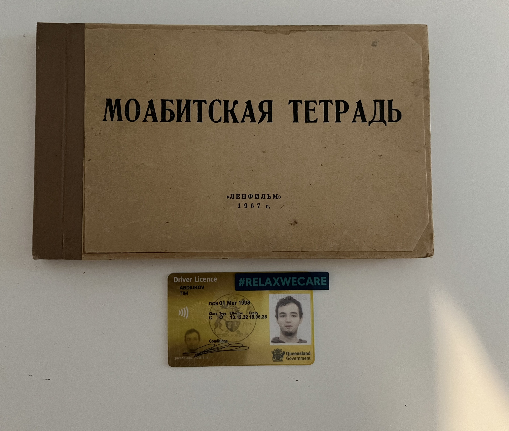

Wormhole planning (or 'when it comes to lies'): Global planning more, attend to petty semantics less.

Recommended music for this article: [Who's Lila? OST - 1 hour of Forest of 512 Sycamores](https://www.youtube.com/watch?v=Hd3BlOq-dss)

I previously owned a one-of-a-kind book, a screenplay for a Soviet movie. Only one copy exists. More than 8 years ago, I conducted research about a pretty in-depth topic where every single party is known to be unreliable. So, what use can come out of falsehood?

Typically, people think that lying party cannot be trusted. In reality, a lying party, even when deceased, may inadvertently be truthful through layers of lies, as can be revealed through analysis of psycho-social patterns, **entropy** (very important!), known agenda, embarrassment, timing, side-channel information, reaction (or lack thereof) to stimuli, and so on. Finally, intuition! If a known lie is identified, then analysis can be conducted to uncover potential motives for a lie, of which there may be multiple. A sane individual typically would not lie or deceive for no reason or reasons.  

There is practical demonstration to it, as well as interrogation playbooks on how to attack lies, for example, at: [JCS - Criminal Psychology](https://www.youtube.com/@JCS)

And when it comes to lies: even thorough and detailed reasons with sound base may not be the key ones.  Complex in nature lies may be based on multiple thorough, **<ins>kaleidoscopic</ins>** lies. They may have complex structure with dead-ends, where the brain itself tries to bridge the unbridgeable. For example, how can an anointed one be evil? 

In effect, the most fruitful line of inquiry ends up the line of questioning the unreliable narrator and their motives. Especially in the case of complex lies, the lies themselves may not be as important in contrast to the reasoning behind production of complex and kaleidoscopic lies.

Side-note: As explored in gamified (and therefore interactive) form, in the horror game of "Who is Lila?", to which there is [8-hour long analysis (lol)](https://www.youtube.com/watch?v=TiH2SjjowKw). Unfortunately, I found what's going on early on, but I thoroughly enjoyed the game and its way of engaging a user (or rather, a soul) by giving bits of information but rarely anything approaching grand-truth.

Propaganda is all the same. Propaganda is still produced by people, and sane people do not lie or deceive lest they have a reason to do so. Propaganda is rarely even close to being complex, though it may be upon necessity. More often, it 'hooks' on to preexisting illiteracy, biases, and fears. It gives false panacea. Propaganda gives simple solutions to complex problems.


Whichever it is and how-so-ever it goes, a lie pre-disposes the lying party (assuming they are sane) to knowing the truth and attempting to somehow hide it, but the truth remains. That was the basis of my analysis and it's not published anywhere yet. Maybe one day, when I have more time.

Below is how the screenplay looks like, and at the same time, proof that I owned it. How did I acquire one-of-a-kind item, an NFT? Trade secret.


*Photo taken on: 29.02.2024 (EXIF not removed), published on 07.03.2024*

```
МОАБИТСКАЯ ТЕТРАДЬ
ЛЕНФИЛЬМ
1967
```

Yes, this is a unique item. However, as one wise man said, "don't be attached to corporeal things". The new custodian of this screenplay is a library in Europe. Information will be online if they choose to go that route.

Yes, the screenplay was safe with me. But what will be its fate in some 50-100 years? People at best plan at most 1 year ahead, and the companies – 3-5, maybe 7 years ahead. Trusted libraries and museums seem to be a safer bet for an NFT.

In the process of communication with this library, they revealed to me of someone receiving a grant to research about a dying language and culture, and attempts to find its routes, which (in my opinion), are somewhere in modern Persia or Azerbaijan. For me, dynamicity and progression are quite important to know I am alive. Especially when it comes to analysis and research. Maybe, the next move will lead me to researching some more obscure and underrated topics? Who knows. 

----------------------
Tim Abdiukov
