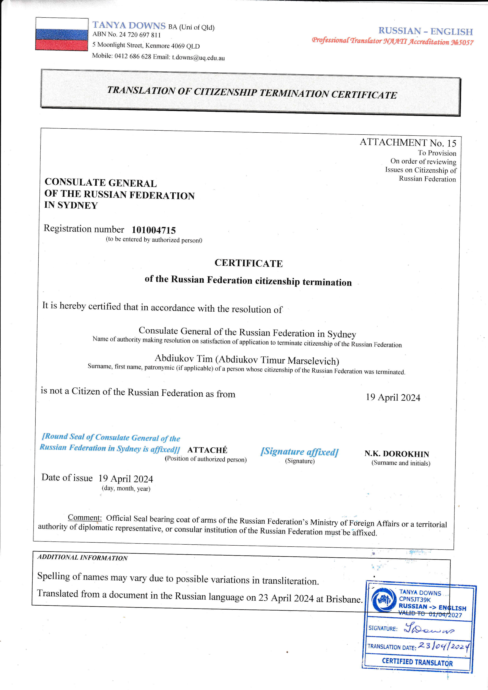
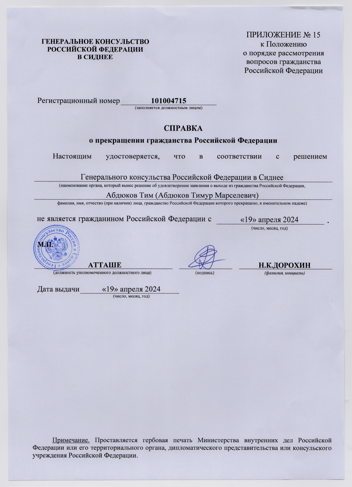

 | 
----
After a 2-year perilous fight, I'm no longer a citizen of the Russian Federation from 19th of April 2024. 

## Discussion

### "Why not just" burn everything

A common myth (especially among sentimental people) is: burning a passport is equivalent to renouncing citizenship. No such laws exist, and they can't logically exist, especially in the context of International Law. 

Complex problems are rarely (if ever) solved with simple solutions.

Burning all passports to renounce citizenship - is equivalent to burning a marriage certificate to divorse. The impact is the same, namely the absence of the result.  
Furthermore, to truly renounce citizenship after it, one would have to prove current citizenship, obtain another hated passport, ultimately taking a very long detour (6 months - 2-3 years) to be able to do it properly.

As sinister as it is, **[prident man rule](https://www.fdic.gov/regulations/examinations/trustmanual/appendix_c/appendix_c.html)** dictates that a party must exercise all (reasonable) actions an ordinary, prudent man will exercise in these circumstances. Hence, as of 2024, the only true way to renounce citizenship is to do it properly.

### Timeline

* 14/03/2022 - Begin multiple renunciation documents collection, translation, replacement, and notary processes.
* 27/12/2022 - All compliant documents acquired. Documents are finally accepted for consideration.
* 19/04/2024 - Renunciation is complete.

### Reasons for Renouncing

Starting from year 2024, 19'th of April is a new Federal holiday in the Russian Federation, ["day in memory of the genocide of the Soviet people](https://www.prlib.ru/en/history/1875231). Not even pertinent to "people**s**" or "nations", this Orwellian holiday is an obvious attempt to play a victim, and to eclipse over and obscure the Soviet responsibility for [Holodomor](https://www.europarl.europa.eu/delegations/en/90-years-after-the-holodomor-recognising/product-details/20230123DPU35102), three famines to be exact.

I'm glad not to be part of this.

In the meantime, [the Russian government refuses insulin to Ukrainians in the occupied territories unless they obtain a russian passport](https://www.businessinsider.com/russia-withholds-meds-ukrainians-who-refuse-russian-passport-2023-7). Insulin-dependent people do die in days without it, so the occupiers would rather be draconian and responsible for death.

Similarly, after Nova Kakhovka dam was blown, [Russian occupiers only allowed Russian passport-holders to leave, leaving eveyone else for dead (Euromaidan press)](https://euromaidanpress.com/2023/06/11/simply-genocide-hundreds-of-ukrainians-drown-as-russia-prevents-evacuation-seals-off-flooded-towns/).

I'm glad not to be part of this. If anything, then may my actions be an inspiration for those who cannot do so. I'm glad to burn this bridge and remove myself from from this horror and sorrow.

 | 
---- | ----
Original | Translation

 | 
---- | 
All documents burned after renunciation. 

----------------------
Tim Abdiukov
