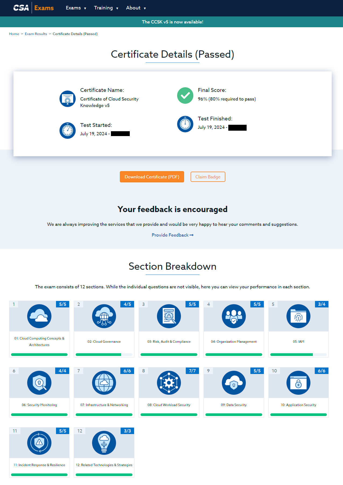

*Every cloud has a silver lining...*

Today, there was a major global Microsoft Azure cloud outage. The world's (mostly service) economy took a blow, and the news keep fuelling hysteria.

How did it affect me? It happened so that on the same day, I took a CSA CCSK v5 upgrade exam. CSA CCSK is about cloud security (governance, applications, networking), and *just* a few days ago, an updated exam came out. **I passed**, screenshot is below,

Prior to that, I passed ISC2 CCSP exam, CCSK v4 exam, and more. Point is, somehow I am home, tired, and, unlike those whiney news anchors or technophobe rsdio hosts, I'm possibly at a unique position to comment about this incident.

What happened from the technical perspective? It's unclear, but it heuristically seems that some system fail-closed much of Azure datacenter infrastructure. Perhaps something in the Azure's global Control plane, less likely in Management plane.

Microsoft as a CSP has SLAs, contractual obligations, security assessment benchmarks - many of which will be breached. As a result of reduced uptime, Microsoft will suffer significant tangible losses (breach penalties, loss of revenue) as well as intangible losses (loss of trust in Azure cloud offerings, FedRAMP jeopardy, overall jeopardy when it comes to Community cloud).

The incident will likely reveal availability management and change management issues within Azure, which will again jeopardize everything else. Is it a good thing? Perhaps yes, because,

1) Perhaps customers had it on easy mode for long, and never considered issues of data portability and app interoperability, e.g., across Availability Zones and / or CSPs.
2) Customers may take greater care to notice underlying vendor lock-in issues, backup management issues, vendor management issues.
3) It's a refresher for CSPs to bolster their availability management and pursue higher data center tiers

Out of something bad, something good can come out as a result. In the meantime, I get to celebrate another achievement.
