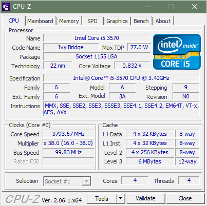
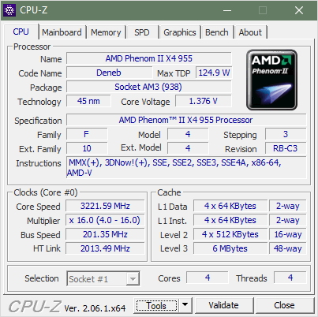

#  AIDA64

* [PC #1 (509kb)](./A-PC-AIDA64.htm)
* [PC #2 (495kb)](./T-PC-AIDA64.htm)

# CPU-Z

* [PC #1 (509kb)](./A-PC-CPU-Z.htm)
* [PC #2 (495kb)](./T-PC-CPU-Z.htm)

# General info

#### PC 1

**No RAM (DDR3)**

* Motherboard: Intel DQ77MK (BIOS settings may need resetting)
	* Onboard GPU: 	Intel HD Graphics 2500
* CPU: 	QuadCore Intel Core i5-3570, 3600 MHz (36 x 100)
* CPU Cooler: Stock Intel
* HDD: WD 2.5 320GB
* PSU: Unbranded (I believe ~400-500w)
* Fan: Zalman

Motherboard is OK, CPU is OK, everything is OK.

#### PC 2

**No PSU, No RAM (DDR3).** 

* Motherboard: 	Gigabyte GA-970A-D3 (BIOS settings were reset)
* CPU: 	QuadCore AMD Phenom II X4 Black Edition 955, 3222 MHz (16 x 201)
* CPU Cooler: Chieftec with a huge fan
* HDD 1: WD 3.5 1TB
* HDD 2: WD 3.5 2TB 
* Fan: Zalman

Motherboard is OK **(case buttons are broken)**, CPU is OK, everything else is OK.

---------------------------------

***[Tim Abdiukov](https://github.com/TAbdiukov)***
