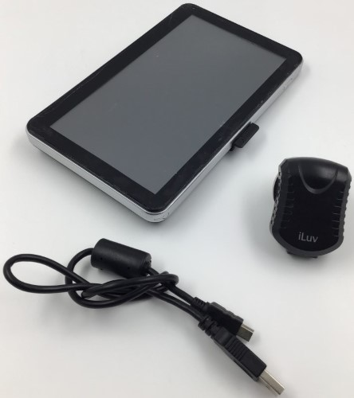

Designed to be a SatNav device, this over-engineered insane device also tries to be a tablet, an MP3 and DVD player, and an eBook-reader. All the while running [Windows CE 6.0](https://en.wikipedia.org/wiki/Windows_Embedded_CE_6.0). It offers 800MHz MTK 2531 CPU, USB OTG and `wininet.dll` support, and GPS reception at 57.6 kBd/s.

## PortTool Logs

* [PortTool v1.0.0.9 *(NUL-bytes removed)*](./PortTool9/port_tool.log)
* [PortTool v1.0.0.24 *(redacted for privacy)*](./PortTool24/port_tool.log)

## System Information (GUI)

```
Rom Version: V.912S.711100.131106.4G
APP Version: V3.2ABF-NUI20-HD-EN
System ID: 0018e420 - 09000000 - 00000000 - 00000001
```

## Back

```
G06

GPS
GPS Satellite Navigation
Output: DC 5V 1.5A
AVBT

DL2014082889…
```

## See also

* [Almost the same device on eBay Kleinanzeigen](https://www.kleinanzeigen.de/s-anzeige/gps-navi-n-go-igo-8-mobiles-devices-5-taschenformat-sehr-gut/2367151721-168-3472)
* [Archiwum Allegro. GPS SATELLITE NAVIGATION OUTPUT DC 5V 1.5A KOMPLE](https://archiwum.allegro.pl/oferta/gps-satellite-navigation-output-dc-5v-1-5a-komple-i6523193715.html)

------------------

* [Navman MOVE75](../2023-12-30-move75)

---------------------------------

***[Tim Abdiukov](https://github.com/TAbdiukov)***
