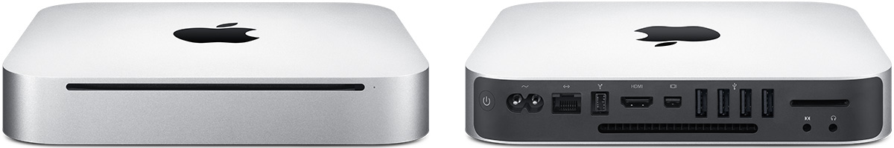
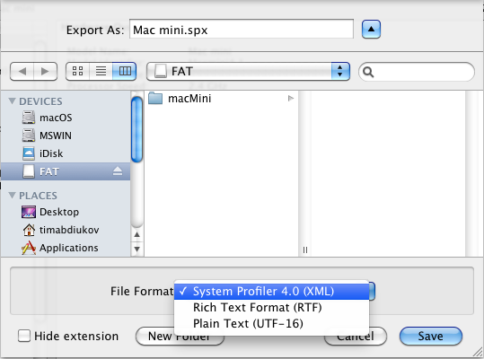

This Mac mini 4,1 belonged to a Distinguished member of Australian Dental Association, who contributed a great deal to this craft. Born in the 1930s, he is alive to this day, enjoying his serene and affluent retirement.

*[Mac mini (Mid 2010) - Technical Specifications (Apple.com)](https://support.apple.com/kb/SP585)* 

## Specs

This particular Mac mini's RAM was upgraded by Apple Inc.
* Slot0: Hynix HMT125S6TFR8C-G7
* Slot1: Hynix HMT125S6TFR8C-G7

*Note*: Information was obtained using [GCHQ CyberChef](https://gchq.github.io/CyberChef/).

## System Profiler

  
* [System Profiler 4.0 (XML)](./Mac-mini.1.spx)
* [Rich Text Format (RTF)](./Mac-mini.2.rtf)
* [Plain Text (UTF–16)](./Mac-mini.3.txt)

---------------------------------

***[Tim Abdiukov](https://github.com/TAbdiukov)***
