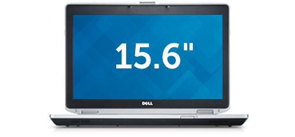
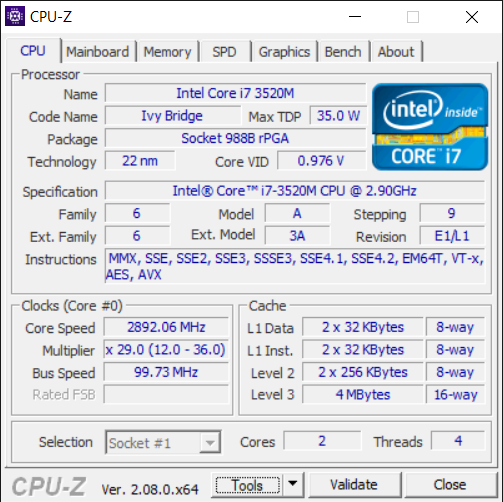

This manufacturer-refurbished (and upgraded) DELL Latitude E6530 is a reliable office laptop from early 2010s, previously was extensively used for study and life. 

This particular model comes with an Intel Core **i7** and 16GB of RAM, so that's good. 

##  Reports

* [AIDA64 v7 (581kb)](./AIDA64-Report.htm)
* [CPU-Z (191kb)](./CPUZ.html)

---------------------------------

***[Tim Abdiukov](https://github.com/TAbdiukov)***
