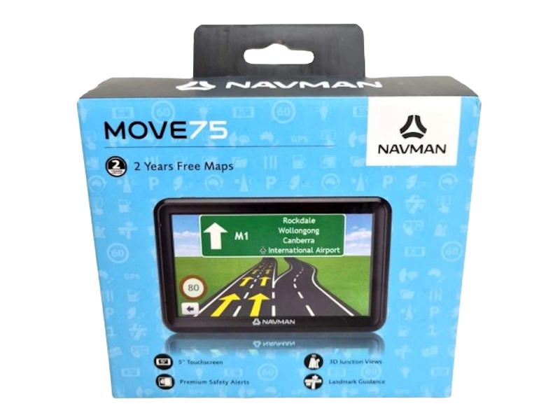

Navman satnav, unlocked and hacked to use iGO maps.

Quote,
> Built with all the GPS essentials to keep you moving safely from A to B, the Move75 boasts a 5" touchscreen with premium features…

Discover more: [TAbdiukov/Navman_MOVE75_Unlock_and_iGO](https://github.com/TAbdiukov/Navman_MOVE75_Unlock_and_iGO)

## PortTool Logs

* [PortTool v1.0.0.9 *(NUL-bytes removed)*](./PortTool9/port_tool.log)
* [PortTool v1.0.0.24 *(redacted for privacy)*](./PortTool24/port_tool.log)

## OEM name

```
MStar Semiconductor
```

## Back

```
Windows Embedded
Compact/CE Core
Microsoft

NAVMAN 
MOVE75
Input 5V==1.5A
MiTAC N502
```

## See also

* [GPS Satellite Navigation / Output: DC 5V 1.5A / AVBT](../2023-12-25-avbt/)

---------------------------------

***[Tim Abdiukov](https://github.com/TAbdiukov)***
