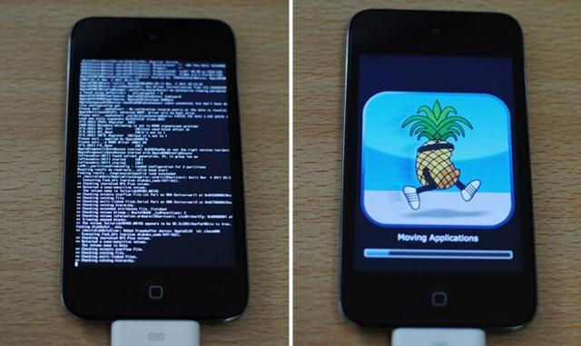

The website [Can I Jailbreak?](https://canijailbreak.com/) lists iOS 6.1.6 as jailbreakable using "p0sixspwn"; however, attempts to use this method were unsuccessful. After extensive research and testing of fragmented and limited information, the findings have been compiled below in the hope that they may be useful to others.

This information is based on this [/r/LegacyJailbreak post of mine from over 5 years ago](https://reddit.com/r/LegacyJailbreak/comments/ftqvul/tutorial_the_lesserknown_way_to_jailbreak_ios_616/).

The task aims to avoid Pangu, 3u tools, and any 'unvetted' third-party tools.
